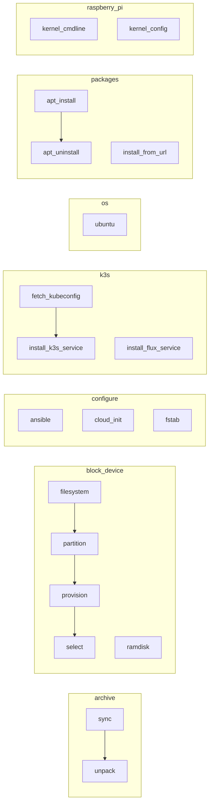

# Architecture Overview

This document provides a high-level overview of the repository's architecture, including Ansible collections, roles, their organization, dependencies, and how they align with the project's goals and principles.

## Ansible Collections

The repository contains the following Ansible collections:

- `archive`: Provides roles for imaging a disk from a pre-built OS image. The primary use case is to unpack a pre-built OS image onto a block device using the `unpack` role. The `sync` role is available for updating existing filesystems but deviates from the immutable infrastructure objective.
- `block_device`: Contains roles for selecting a disk based on user-provided criteria (using lsblk output), creating partitions, and creating file systems within the selected block device.
- `configure`: Includes roles for configuring various common system services and settings, such as `systemd`, `cloud-init`, and `fstab`, to make the host bootable after the OS image is unpacked.
- `k3s`: Provides roles for installing and managing K3s Kubernetes distribution on the provisioned host, including installing K3s as a server or agent node, installing FluxCD, and fetching the kubeconfig.
- `os`: Used to apply a set of pre-determined requirements on top of an official Ubuntu image (usually from an LTS release). This collection is used by the Packer build process in the separate `homelab-ops-packer` repository to create the base OS image. The requirements applied by this collection include:
  - Installing and uninstalling a user-defined set of packages using the `packages` collection
  - Disabling services related to the removed packages
  - Applying user-defined kernel attributes (sysctl) and configuring kernel modules
  - Upgrading the kernel and all packages to the latest versions
  - Building a new initramfs to reflect the changes
  - Ensuring the presence of both compressed (vmlinuz) and uncompressed (vmlinux) kernels
- `packages`: Contains roles for installing and managing software packages. Used by the `os` collection to install and uninstall required packages.
- `raspberry_pi`: Provides roles specific to Raspberry Pi devices, including:
  - Configuring the kernel cmdline and kernel config.txt
  - The `provision` role, which brings together the `block_device`, `configure`, and `kernel_<*>` roles to create a bootable Raspberry Pi device using the image from the Packer build

These collections work together to provision and configure infrastructure for both x86_64 and arm64 architectures.

## Role Organization and Dependencies



The diagram above shows the dependencies between roles within each collection. Key points:

- In the `archive` collection, the `unpack` role depends on the `sync` role
- The `block_device` collection has a chain of dependencies: `select` -> `provision` -> `partition` -> `filesystem`
- Roles within the `configure`, `os`, and `packages` collections are independent
- In the `k3s` collection, the `install_k3s_service` role depends on `fetch_kubeconfig`
- The `raspberry_pi` collection's `provision` role brings together the `block_device`, `configure`, and `kernel_<*>` roles

## Provisioning Workflow

The collections in this repository work together to provision and configure infrastructure following this general workflow:

1. The `os` collection, used by the Packer build process in the `homelab-ops-packer` repository, creates a base OS image by applying pre-determined requirements on top of an official Ubuntu image. This includes using the `packages` collection to install and uninstall required packages.

2. The `block_device` collection selects a disk based on user-provided criteria (using lsblk output) and creates partitions and filesystems on that disk.

3. The `archive` collection's `unpack` role is used to unpack the image resulting from the `os` collection onto the filesystem created by `block_device`.

4. After the image is unpacked, the `configure` collection is used to configure additional system details, such as cloud-init and fstab, to make the host bootable.

5. For Raspberry Pi devices, the `raspberry_pi` collection's `provision` role brings together the `block_device`, `configure`, and `kernel_<*>` roles to create a bootable Raspberry Pi device using the image from the Packer build.

6. The host is then booted and configures itself according to the cloud-init configuration.

7. Once the host is ready, the `k3s` collection's roles (`install_k3s_service`, `install_flux_service`, and `fetch_kubeconfig`) are used to install and configure K3s and FluxCD on the provisioned host. The `install.yaml` playbook orchestrates these roles.

This workflow enables the creation of immutable infrastructure, where hosts are provisioned from a base image and replaced entirely when updates are needed, rather than being patched incrementally.

## Alignment with Project Goals

The Ansible collections and roles are designed to meet the project's goals as outlined in the [Product Context](productContext.md):

- **Reliability and Security**: Roles follow best practices for Ansible module usage, error handling, and security hardening. Molecule tests ensure consistent behavior.
- **Performance and Efficiency**: Roles are optimized for fast execution, minimal resource usage, and idempotency. Tags allow selective execution of tasks.
- **Simplicity and Flexibility**: Roles have sensible defaults but allow customization via input parameters. Collections are organized for easy discovery and use.
- **Immutable Infrastructure**: Roles are designed for initial provisioning and configuration rather than incremental updates. Idempotency ensures consistent state.
- **Declarative Approach**: Roles define desired state via input parameters, and Ansible ensures that state is reached. Re-running roles with same parameters is a no-op.

## CI/CD Integration

The repository uses GitHub Actions for CI/CD. Key workflows:

- **Molecule Tests**: Triggered on pull requests, runs Molecule tests for affected roles
  ```mermaid
  graph LR
    PR[Pull Request] --> Lint[Ansible Lint]
    Lint --> Molecule[Molecule Test]
    Molecule --> Destroy[Destroy Test Infra]
  ```

- **Release**: Triggered on pushes to main branch, publishes updated collections to Ansible Galaxy
  ```mermaid
  graph LR
    Push[Push to main] --> Release[Publish to Galaxy]
  ```

Refer to the `.github/workflows` directory for details on CI/CD workflow configuration.

## External Dependencies

The collections and roles have minimal external dependencies to ensure ease of use and compatibility:

- Ansible 2.9 or newer
- Python 3.6 or newer
- Specific OS versions and packages as noted in individual role README files

Python dependencies for development and testing are managed via `poetry` and defined in `pyproject.toml`.